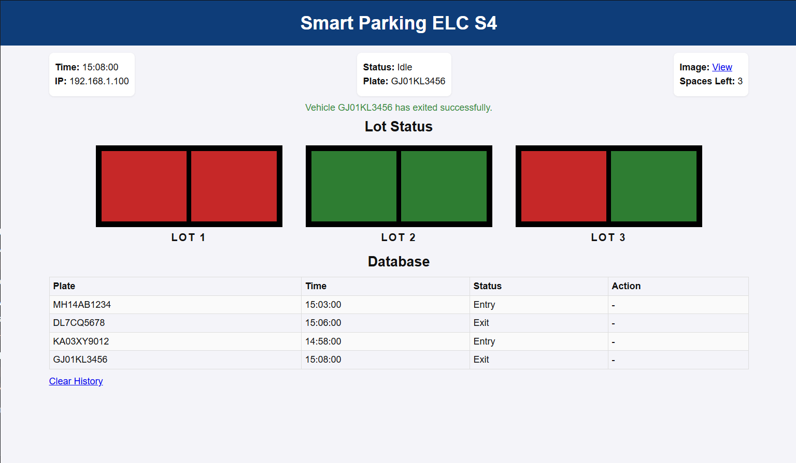
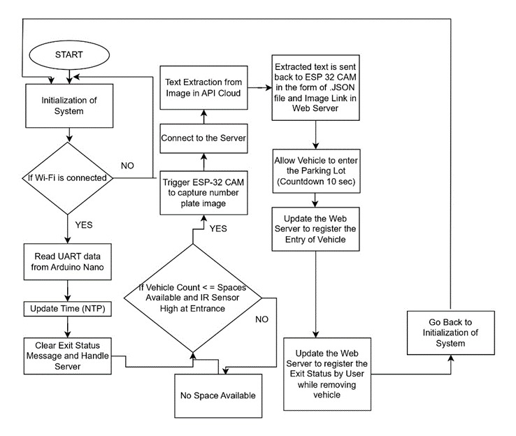
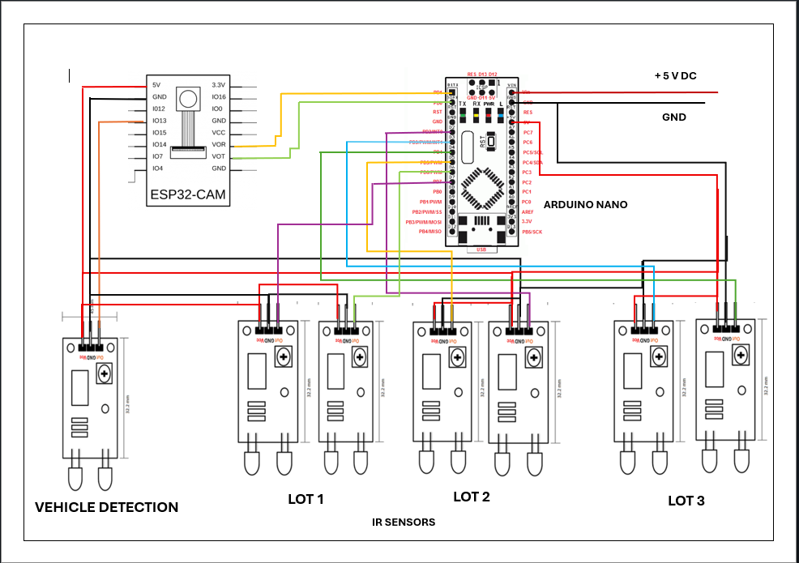

# Smart Vehicle Parking System using ESP32-CAM

## 📌 Project Overview

The **Smart Vehicle Parking System** is an IoT-based solution designed to automate vehicle entry, space allocation, and number plate recognition in a parking facility. The system leverages an **ESP32-CAM** module for image capture and number plate extraction, while an **Arduino Nano** manages multiple IR sensors to detect vehicle occupancy across parking lots.

A key feature of this system is **intelligent space utilization** — depending on the number of sensors triggered in a single lot, the system can distinguish between a 2-wheeler and a 3/4-wheeler, allowing two 2-wheelers to share one lot if only one sensor is activated per vehicle.

Users can access a real-time web interface (UI) by connecting to the same local Wi-Fi network as the ESP32-CAM. For easy access, **QR codes** are generated and displayed at the facility entrance.

---

## 📸 System Images

### User Interface Dashboard

### System Flowchart

### Circuit Diagram

---

##  How It Works

1. **System Initialization**  
   The ESP32-CAM connects to a Wi-Fi network and initializes UART communication with the Arduino Nano.

2. **Vehicle Detection**  
   - IR sensors at the entrance detect an incoming vehicle.  
   - The system checks if parking spaces are available.

3. **Number Plate Extraction**  
   - The ESP32-CAM captures an image of the vehicle's number plate.  
   - The image is sent to the [CircuitDigest.cloud API](https://www.circuitdigest.cloud/) for text extraction.  
   - Extracted text (plate number) is received back as a JSON file along with an image link.

4. **Entry & Update**  
   - If space is available, the barrier opens (countdown: 10 seconds).  
   - The web server is updated with the vehicle's entry time and plate number.

5. **Lot Occupancy Logic**  
   - Each parking lot has **two IR sensors**.  
   - **Both sensors triggered** → 4-wheeler or 3-wheeler occupies the entire lot.  
   - **Only one sensor triggered** → 2-wheeler occupies half the lot, allowing another 2-wheeler to park in the same lot.

6. **Exit Process**  
   - User initiates exit via the UI.  
   - The system updates the web server with exit status and time.  
   - The space is marked as available again.

7. **UI Access**  
   - Users connect to the same Wi-Fi network as the ESP32-CAM.  
   - Scan the QR code displayed at the facility → Opens the real-time dashboard.

---

## 📁 Repository Contents

| File Name                        | Description                                                                 |
|----------------------------------|-----------------------------------------------------------------------------|
| `UI.png`                         | Screenshot of the web interface showing lot status, database, and controls.|
| `Flowchart.jpeg`                 | Complete system flowchart from initialization to exit handling.            |
| `CIRCUIT_DIAGRAM_Smartparking.png` | Circuit connections between ESP32-CAM, Arduino Nano, IR sensors, and power.|
| `ESPCAMcode.ino`                 | Main code for ESP32-CAM — Wi-Fi, API calls, UART communication, web server.|
| `Arduino_nano_parking.ino`       | Code for Arduino Nano — reads IR sensors and sends occupancy data via UART.|

---

## 🔧 Hardware Components

- **ESP32-CAM** – Captures number plate images, connects to Wi-Fi, calls API, hosts web UI.
- **Arduino Nano** – Reads multiple IR sensors (ESP32-CAM has limited GPIO pins).
- **IR Sensors** – Two per parking lot for vehicle classification and occupancy detection.
- **5V Power Supply** – Common power for both modules.
- **UART Connection** – Serial communication between Nano and ESP32-CAM.

> 🧩 **Why Arduino Nano?**  
> The ESP32-CAM has limited GPIO pins, making it insufficient to directly connect multiple IR sensors. The Arduino Nano handles sensor reading and sends aggregated data to the ESP32-CAM via UART.

---

## 🌐 API Integration

The system uses the **CircuitDigest.cloud API** for number plate extraction:

- Endpoint: `https://www.circuitdigest.cloud/`
- Method: POST (image upload)
- Response: JSON containing extracted plate number and image link

---

## 🖥️ User Interface (UI)

The web dashboard displays:

- Current time & ESP32-CAM IP address  
- Real-time lot status (LOT 1, LOT 2, LOT 3)  
- Spaces left  
- Last captured plate number & image link  
- Database table with all entries/exits (Plate, Time, Status)  
- **Clear History** button  
- Exit confirmation messages (e.g., *"Vehicle GJ01KL3456 has exited successfully"*)

### Access via QR Code

Generate a QR code encoding the ESP32-CAM's local IP address (e.g., `http://192.168.1.100`).  
Place the QR code at the parking facility entrance/exit. Users scan it to open the UI on their phone.

---

## 🚀 Getting Started

### 1. Hardware Setup

- Connect IR sensors to Arduino Nano as per the circuit diagram.
- Connect ESP32-CAM to Arduino Nano via UART (TX/RX).
- Provide common 5V power to both modules.

### 2. Software Setup

- Install **Arduino IDE** with ESP32 board support.
- Install required libraries (WiFi, HTTPClient, ArduinoJson, etc.).
- Update Wi-Fi credentials and API endpoint in `ESPCAMcode.ino`.
- Upload `Arduino_nano_parking.ino` to Arduino Nano.
- Upload `ESPCAMcode.ino` to ESP32-CAM.

### 3. Run the System

- Power on the system.
- ESP32-CAM will display its IP address on Serial Monitor.
- Generate a QR code from that IP and display it at the facility.
- Open the UI via any device on the same network.

---

## 📈 Future Enhancements

- Add a buzzer or LED indicator for space full/available.
- Store parking history in a cloud database for remote access.
- Integrate payment gateway for paid parking.
- Use a larger display at the entrance showing available lots.

---

## 👥 Contributors

This project was developed as a course project for **Embedded Systems / IoT** to demonstrate real-world application of microcontrollers, sensors, cloud APIs, and web technologies.

---

## 📜 License

This project is open-source and available for educational and non-commercial use.

---

*For any queries or support, please refer to the circuit diagram and in-code comments.*
